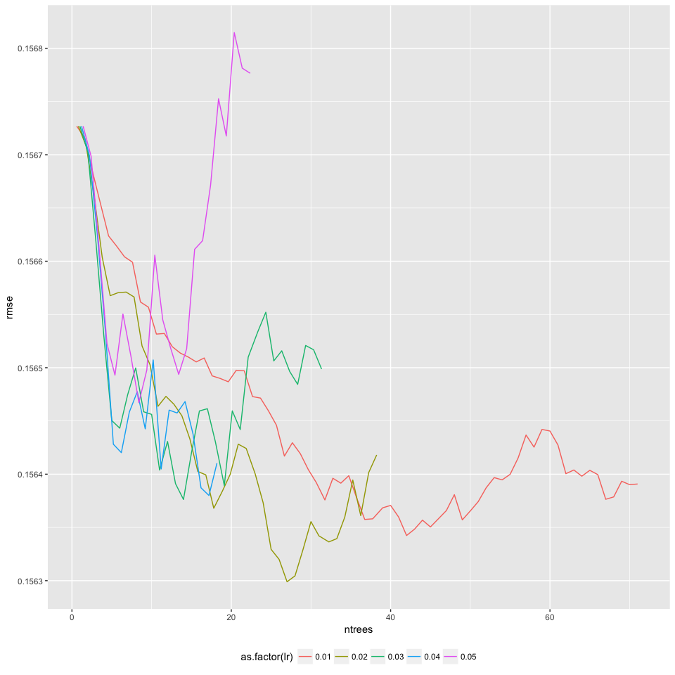

# Tuning the GBM learning rate
Sidharth Gupta  
\today  


```r
library(dplyr)
library(magrittr)
library(gridExtra)
library(ggplot2)
library(h2o)
library(gridExtra)
library(futile.logger)
source("h2o/source-for-rmd.R")
h2o.init()
```

In this vignette I will try and get a feel for the learning rate by training many GBM models on just the learning rate. Once these models are trained I will look at the scoring history and what learning rate does well.

First lets use the wrapper routines and prepare some data.


```r
# The function for reading the data does a few things by default. It makes categorical  variables where ever necessar, and log transforms the large variables like for taxes etc. See documentation of that function.
list[tr.baseline, pr.baseline, vtreatIdentityFn, tplan.NULL] =  prepareDataWrapper.h2o.gbm.baseline()

independent.vars = colnames(tr.baseline %>% select(-logerror))

list[XTrain, YTrain, XHoldout, YHoldout] = splitTrainingWrapper(tr.baseline, split_percent=0.90, YName="logerror")
```


```r
XYTrain.h2o = as.h2o(x = cbind(XTrain, logerror=YTrain), destination_frame="XTrain.h2o")
XYTest.h2o = as.h2o(x = cbind(XHoldout, logerror=YHoldout), destination_frame="XTest.h2o")
```


<p>There are two data sets one used in the training and the other held out as a validation set. I created a grid with defaults, especially a large number of trees. But becasue we have early stopping we should be ok.</p>


```r
hyper_params_search_crit.learnrate.tune = function(
            ntrees_opts = 10000, # early stopping will stop the earlier.
            max_depth_opts = 10,  # Start with 6 for now
            min_rows_opts = 5,   # How many leaf nodes to average over, doing the log of # rows would be ok
            learn_rate_opts = 0.01,
            learn_rate_annealing = 1,
            sample_rate_opts = 0.9,
            col_sample_rate_opts = 0.9,
            col_sample_rate_per_tree_opts = 0.9,
            strategy="RandomDiscrete") {

    list[search_criteria, hyper_params] =  hyper_params_search_crit(
            ntrees_opts = ntrees_opts,
            max_depth_opts = max_depth_opts,
            min_rows_opts = min_rows_opts,
            learn_rate_opts = learn_rate_opts, # from the previous
            learn_rate_annealing = learn_rate_annealing,
            sample_rate_opts = sample_rate_opts,
            col_sample_rate_opts = col_sample_rate_opts,
            col_sample_rate_per_tree_opts = col_sample_rate_per_tree_opts,
            strategy=strategy)
    return(list(search_criteria, hyper_params))
}
```


Here is the wrapper written to do the model fit.

```r
baseline.fit = function(hp, sc, grid_id = "learning_rate_search", seed=123456) {
        h2o.grid.helper(
                        h2o.getFrame("XTrain.h2o"),
                        h2o.getFrame("XTest.h2o"),
                        independentCols=independent.vars,
                        hyper_params = hp,
                        search_criteria = sc,
                        algorithm="gbm",
                        grid_id=grid_id,
                        seed = seed
                        )
}
```

Now lets train a few models. We train a few models a few times to compare learning rates


```r
NGrids = 10
target_learning_rates = seq(0.01, 0.05, 0.01)
list[search_criteria.gbm.learnrate, hyper_params.gbm.learnrate] =
    hyper_params_search_crit.learnrate.tune(learn_rate_opts=target_learning_rates)
# Randomize and search for the best learning rate.
cls = registerCluster(max.cores.per.machine = 6)
fits = foreach(x = 1:NGrids, .packages= c("h2o")) %dopar% {
              h2o.connect()
              baseline.fit(
                       hp=hyper_params.gbm.learnrate,
                       sc=search_criteria.gbm.learnrate,
                       grid_id = paste("learning_rate_search_", x, sep=''),
                       seed = as.integer(runif(1, 1e5, 1e6)))
}
```

Save the models optionally

```r
LOCAL.RESULTS.DIR=paste0(getwd(), "/results/learn_rate_2018_05_04_gbm")
if(!dir.exists(LOCAL.RESULTS.DIR)) 
    dir.create(LOCAL.RESULTS.DIR)
h2o.gridSaver(Map(function(x) paste0("learning_rate_search_",x) , 1:NGrids), results.dir=LOCAL.RESULTS.DIR)
```

Optionally load the grids

```r
LOCAL.RESULTS.DIR=paste0(getwd(), "/results/learn_rate_2018_05_04_gbm")
models = h2o.gridLoader(Map(function(x) paste0("learning_rate_search_",x) , 1:14), results.dir=LOCAL.RESULTS.DIR)
```

Extract the models from each grid in an list of lists. Note here that each grid has `length(target_learning_rates)` GBM models.

```r
# A list of lists of all the trained models

models.lst = sapply(X = 1:NGrids,
                    FUN=function(x) {
                        grid.id = h2o.getGrid(paste("learning_rate_search_", x, sep=''))
                        sapply(X=grid.id@model_ids, FUN=h2o.getModel)
                    })
print(dim(models.lst))
```

First extract the score histories of each of the models into a data frame
and stuff them into a list.

```r
getRMSEScoreHistory = function (models) {
    # Given a list of model ids get a data frame with its RMSE score history
    score.history = data.frame()
    # Learning rate of 0.03 seems to be ok.
    for (i in 1:length(models)) {
        model.rmse = h2o.rmse(h2o.performance(models[[i]]))
        lr = models[[i]]@parameters$learn_rate
        model.rmse.rate = h2o.scoreHistory(models[[i]]) %>%
            data.frame %>%
            pull(validation_rmse)
        score.history = rbind(score.history,
                              data.frame(
                                         ntrees = 1:length(model.rmse.rate),
                                         rmse = model.rmse.rate,
                                         id = i,
                                         lr = lr
                                         )
                              )
    }
    score.history
}

# Sanity check: each column is one grid. There are NGrids grids
# and each grid has length(target_learning_rates) models
assertthat::assert_that(ncol(models.lst) == NGrids)

# For each model list in models.lst extract the histories
score.history.lst = sapply(X = 1:NGrids,
                           function(x) getRMSEScoreHistory(models.lst[, x]))
score.history.combined =
    Reduce(function(x, init) {
               rbind(x, init)
          }, Map(function(i) {
                score.history.lst[, i] %>%
                    data.frame %>%
                    mutate(grid_id=i)
            }, 1:NGrids)
    )
```

So how do the learning curves look for each grid? Lets plot them.


```r
# I initially tried working with a lits of plots instead of plotting the data directly. Had trouble sizing the plots properly. So backed off and instead used a combined version of score history with vanialla ggplot.
min_y_lim = score.history.combined %>% pull(rmse) %>% min
max_y_lim = score.history.combined %>% pull(rmse) %>% max

ggplot(score.history.combined) +
    facet_wrap(~ grid_id, ncol=2) +
        geom_line(aes(y=rmse, x=ntrees, color=as.factor(lr)),
                  position=position_dodge(1)) +
        ylim(c(min_y_lim, max_y_lim)) +
        theme(
          legend.position="bottom",
          strip.background = element_blank(),
          strip.text.x = element_blank()
        )
```

<!-- -->

It seems clear that 13/15 of the curves the learning curves corresponding to 0.01-0.02 end up lower without the validation error overshooting. We can see that for every discrete learning rate the minimum RMSE for 0.1-0.2 remain quite stable.


```r
score.history.combined %>% group_by(grid_id, lr) %>% 
    dplyr::filter(ntrees==max(ntrees)) %>%
    data.frame %>% group_by(grid_id) %>% 
    dplyr::filter(rmse ==min(rmse)) %>%
    arrange(rmse)
```

```
## # A tibble: 10 x 5
## # Groups:   grid_id [10]
##    ntrees      rmse    id    lr grid_id
##     <int>     <dbl> <int> <dbl>   <int>
##  1     38 0.1657399     1  0.01       1
##  2     31 0.1657472     1  0.01       7
##  3     32 0.1657528     1  0.01       8
##  4     29 0.1657552     1  0.01       6
##  5     40 0.1657605     1  0.01       2
##  6     38 0.1657782     1  0.01       4
##  7     24 0.1657972     1  0.01       3
##  8     30 0.1658176     1  0.02       9
##  9     31 0.1658258     1  0.01      10
## 10     21 0.1658318     1  0.01       5
```

But the lowest RMSEs do have some overall lowest values for higher learning rates. Not sure what to make of that.


```r
score.history.combined %>% 
    group_by(grid_id) %>% 
    dplyr::filter(rmse == min(rmse)) %>% 
    data.frame %>% 
    arrange(rmse)
```

```
##    ntrees      rmse id   lr grid_id
## 1      13 0.1657022  4 0.04       1
## 2      11 0.1657313  4 0.04       5
## 3      33 0.1657399  1 0.01       2
## 4      24 0.1657409  1 0.01       6
## 5      25 0.1657436  1 0.01       7
## 6      33 0.1657491  1 0.01       4
## 7      26 0.1657516  1 0.01       8
## 8      18 0.1657703  1 0.01       3
## 9      25 0.1657789  1 0.02       9
## 10      9 0.1657815  3 0.03      10
```


